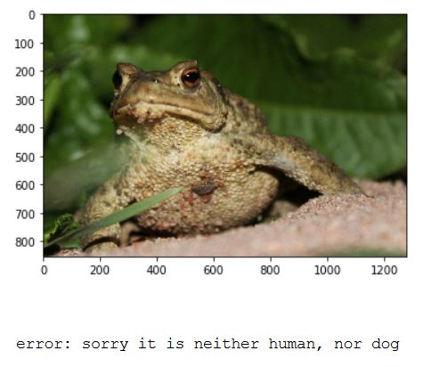
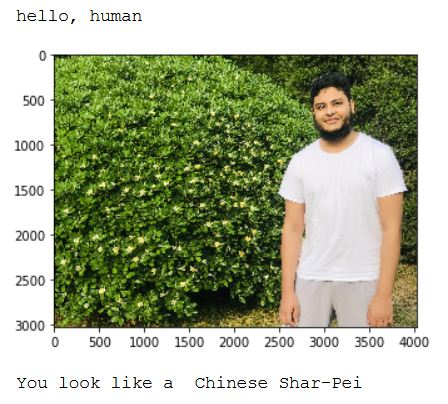

# Udacity-Deep-Learning-Nanodegree-Dog-Breed-Classifier


For this project I was given two folders of images. One representing humans and one representing dogs. The folder representing dogs was     categorized according to breed, with 64 images of each dog breed. The folder representing dogs was also seperated into a training,         validation and testing set. Each dog breed in training folder was represented by approximatly 50 images.

## Purpose and Results

This Project had multiple goals.

- The first Goal of the project was to utilize a given CascadeClassifier algorithm to detect if a human face was present in an input image.


- The second Goal of the project was to use the VGG16 algorithm to detect if a dog was present in an input image and give an accuracy of how well the algorithm performs. The results of this architecture can be seen below.

             Humans detected as dogs .. 0%
             
- The Third Goal of the project was to create and train a Convolutional Neural Network from scratch to classify different dog breeds. This prediction model must achive an accuracy of above 10%. The results that this architecture achived can be seen below.


             Test Loss: 3.574266 
             Test Accuracy: 20% (175/836)

- The fourth Goal of the project was to utilize transfer learning by adapting the RESNET-50 prediction model to classify the given dog breeds. The implementation was done by retraining the classification layer of the pretrained RESNET-50 architechture on the 113 classes of dog breeds given in the dataset. The results of this architecture can be seen below.
           

             Test Loss: 1.169539 
             Test Accuracy: 70% (592/836)


## Conclusion

This project introduced me to what a Convolutional Nerual Network is, how its architecture is made with filters, pooling and dropout layers and the benefits that can be gained when taking advantage of transfer learning.\
The project implementation can be found [here](https://github.com/SyedTauhidShah/Udacity-Deep-Learning-Nanodegree-Dog-Breed-Classifier/blob/master/dog_app.ipynb)

## Requirements

Jupyter notebook must be installed. Python must be installed. The following python modules must be installed.
       
```
opencv-python
jupyter
matplotlib
pandas
numpy
pillow
scipy
tqdm
scikit-learn
scikit-image
seaborn
h5py
ipykernel
bokeh
pickleshare
```

## Results


Dog!


Neither Human nor Dog!



Human


